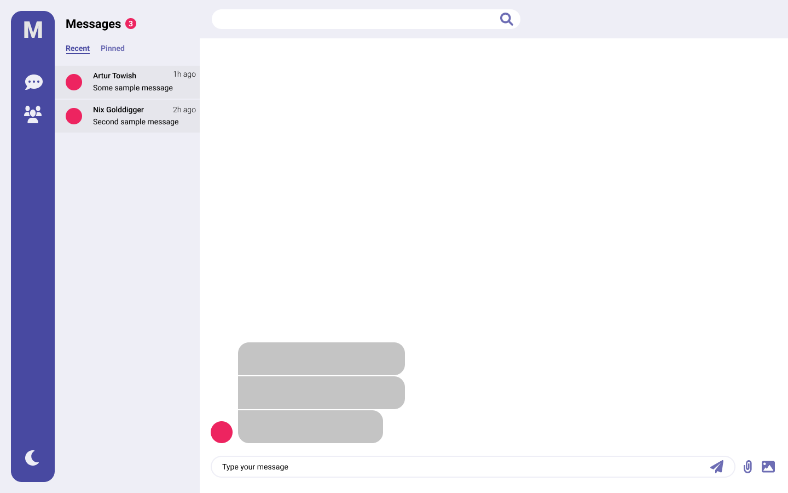
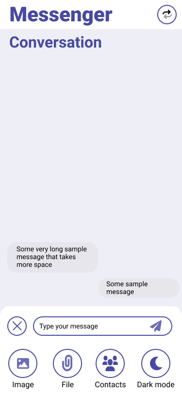
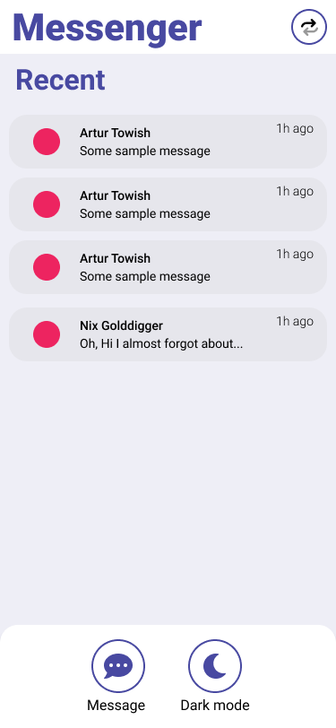

# messenger-cv
Extended version of *PB138* seminar project inteded as an example of my __ReactJS__ skills.

> **Note**\
> This repository is currently __under development__.\
> You can check out the code and start the app without DB content as backend is WIP.

### Packages used
- ReactJS
- Vite
- ESLint: [config](https://github.com/lesad/messenger-cv/blob/master/.eslintrc.json)
- SWR: [config](https://github.com/lesad/messenger-cv/blob/master/src/containers/Provider.tsx),
       [usage](https://github.com/lesad/messenger-cv/blob/master/src/core/api/swr.tsx)
- styled-components: [themes](https://github.com/lesad/messenger-cv/tree/master/src/core/theme),
                     [usage](https://github.com/lesad/messenger-cv/blob/master/src/components/Header/Header.tsx)
- Recoil: [store](https://github.com/lesad/messenger-cv/blob/master/src/core/store/atoms.ts),
          [usage](https://github.com/lesad/messenger-cv/blob/master/src/core/api/submit.tsx)

### Points of interest
- TypeScript [models](https://github.com/lesad/messenger-cv/tree/master/src/core/models)
- Modern layout using [grid](https://github.com/lesad/messenger-cv/blob/master/src/App.tsx) 
  and [flexbox](https://github.com/lesad/messenger-cv/blob/master/src/containers/Chat/Chat.tsx)

### Run the project
```npm run dev```

### What you should expect
- Desktop\

- Mobile\


